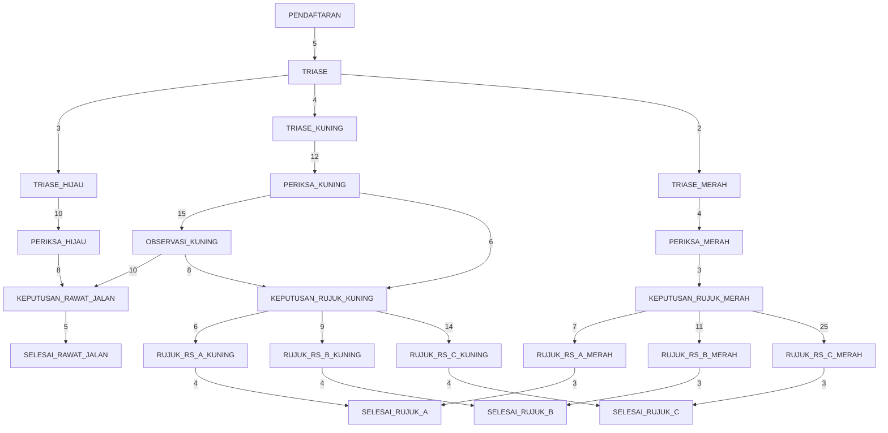

# DelCare Copilot

**Sistem Pendukung Keputusan Cerdas untuk Optimasi Alur Layanan Klinik Kampus dan Keputusan Rujukan Berbasis Uniform Cost Search**

Proyek Akhir (PjBL) — Mata Kuliah 10S3001 Kecerdasan Buatan
Program Studi Sarjana Sistem Informasi, Institut Teknologi Del
Semester Gasal 2026/2027

## Milestone 1 — Business Problem Framing, Spesifikasi PEAS & Baseline Search

### 1. Latar Belakang Singkat

Klinik/Poliklinik Kampus menangani beragam keluhan mahasiswa dan staf dengan
tingkat urgensi berbeda (ringan, sedang, gawat darurat). Keputusan penting
yang berulang setiap hari adalah: **kategori triase apa yang tepat, dan jika
perlu dirujuk, ke rumah sakit mitra mana** — dengan mempertimbangkan waktu
tunggu, jarak tempuh, dan risiko klinis jika penanganan tertunda.

DelCare Copilot memodelkan alur ini sebagai **masalah pencarian ruang
keadaan (state-space search)**, di mana agen membantu merekomendasikan
jalur penanganan berbiaya minimum — bukan sekadar "termurah", tetapi
"termurah dengan mempertimbangkan risiko klinis" (lihat Bagian 3).

### 2. Spesifikasi PEAS

| Komponen | Deskripsi |
|---|---|
| **Performance Measure** | Waktu tunggu rata-rata dari keluhan ke keputusan tindakan (target < 15 menit untuk kasus non-darurat); akurasi rekomendasi dibanding keputusan dokter (≥ 85%); nol rekomendasi tanpa dasar SOP; tingkat kasus gawat darurat yang tertangani tanpa keterlambatan |
| **Environment** | Partially observable (kondisi pasien tidak sepenuhnya teramati sistem), stochastic (respons klinis & ketersediaan RS tidak pasti), sequential (keputusan triase memengaruhi keputusan berikutnya), dynamic (antrean & kapasitas RS berubah), discrete (kategori & tahap berbentuk diskret) |
| **Actuators** | Rekomendasi tindakan (observasi/rawat jalan/rujuk), draf surat rujukan, notifikasi ke petugas, pemilihan RS tujuan |
| **Sensors** | Form keluhan & tanda vital, riwayat kunjungan, status ketersediaan RS mitra |

### 3. Formulasi Ruang Keadaan (X, A, T, G, C)

- **State (X):** kombinasi `(tahap_layanan, kategori_triase)`, mis. `PERIKSA_KUNING`, `RUJUK_RS_A_MERAH`. Lihat daftar lengkap di `src/graph_data.py`.
- **Aksi (A):** transisi antar-state, memuat label *actuator* (`tetapkan_kategori_merah_prioritas`, `pilih_rujukan_RS_A`, dst).
- **Transisi (T):** deterministik pada baseline ini (disederhanakan dari kondisi stochastic dunia nyata) — perluasan probabilistik direncanakan pada milestone lanjutan (mis. Markov Decision Process).
- **Goal (G):** salah satu dari `{SELESAI_RAWAT_JALAN, SELESAI_RUJUK_A, SELESAI_RUJUK_B, SELESAI_RUJUK_C}`.
- **Cost (C):** menit-ekuivalen = waktu tunggu/proses + estimasi waktu tempuh RS rujukan + penalti risiko klinis (dibuat besar untuk kasus `MERAH` menuju RS jauh, agar agen menghindari lintasan lambat pada kasus gawat darurat).

### 4. Diagram Graf Ruang Keadaan



### 5. Menjalankan Proyek

Prasyarat: [Astral `uv`](https://docs.astral.sh/uv/) sudah terpasang.

```bash
# 1. Clone repositori
git clone <URL_REPOSITORI_KELOMPOK>
cd delcare-copilot

# 2. Sinkronisasi environment (membuat .venv otomatis)
uv sync

# 3. Jalankan baseline search
uv run python -m src.cli --compare
uv run python -m src.cli --start TRIASE_MERAH --algo astar
uv run python -m src.cli --start KEPUTUSAN_RUJUK_KUNING --algo ucs

# 4. Jalankan seluruh unit test (termasuk uji admissibility & consistency heuristik)
uv run pytest -v
```

### 6. Struktur Repositori

```
delcare-copilot/
├── pyproject.toml          # Konfigurasi proyek & dependensi (Astral uv)
├── README.md
├── LICENSE
├── src/
│   ├── graph_data.py        # Graf domain: node, goal, bobot biaya bisnis
│   ├── cli.py                # Entry point CLI
│   └── search/
│       ├── ucs.py            # Uniform Cost Search (heapq)
│       ├── astar.py          # A* Search (heapq + heuristik)
│       └── heuristics.py     # Heuristik admissible + bukti matematis
└── tests/
    ├── test_ucs.py
    ├── test_astar.py
    └── test_admissibility.py  # Bukti empiris admissibility & consistency
```

### 7. Hasil Baseline (contoh)

| Skenario (start) | Lintasan Optimal | Total Biaya | Node Diekspansi (UCS vs A*) |
|---|---|---|---|
| `TRIASE_HIJAU` | HIJAU → PERIKSA → RAWAT JALAN → SELESAI | 23 | 4 vs 4 |
| `TRIASE_KUNING` | KUNING → PERIKSA → RUJUK LANGSUNG → RS_A → SELESAI | 28 | 5 vs 5 |
| `TRIASE_MERAH` | MERAH → PERIKSA → RUJUK SEGERA → **RS_A** (bukan RS_C) → SELESAI | 17 | 5 vs 5 |

Perhatikan pada skenario `MERAH`: meskipun RS_C mungkin terdaftar sebagai
opsi, algoritma secara konsisten memilih **RS_A** karena bobot rujukan ke
RS_C sengaja dibuat besar (mensimulasikan jarak/waktu tempuh jauh) —
menunjukkan bahwa optimasi biaya benar-benar memengaruhi rekomendasi
klinis, bukan sekadar urutan pendefinisian di kode.

### 8. Tim & Peran

| Nama | NIM | Peran |
|---|---|---|
| Angga Sianipar  |12S24032 | AI Architect & Model Lead |
| Enjel Ayuti Napitupulu | 12S24056 | Data & Knowledge Engineer |
|Theresia Oktaviani Samosir | 12S24055 | Integration & Interface Engineer / QA, Evaluation & Ethics Lead |

### 9. Roadmap Milestone Selanjutnya

- **Milestone 2 (W04):** CSP/GA untuk alokasi jadwal petugas & kapasitas RS mitra.
- **Milestone 3 (W07):** RAG atas korpus SOP klinik, protokol triase Kemenkes, daftar RS rujukan.
- **Milestone 4 (W11):** Agen ReAct + FastMCP untuk orkestrasi rekomendasi otomatis.
- **Milestone 5 (W13):** Dashboard Gradio untuk petugas klinik.

## Lisensi

Proyek ini dilisensikan di bawah [MIT License](LICENSE).
